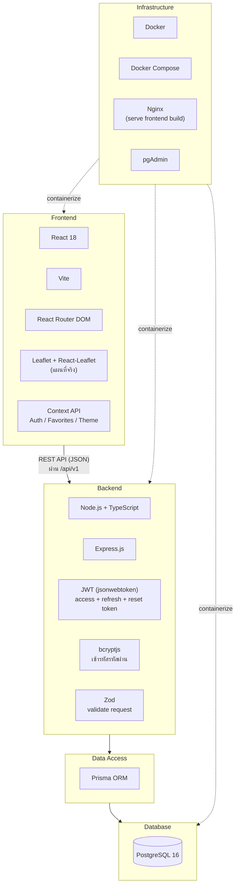
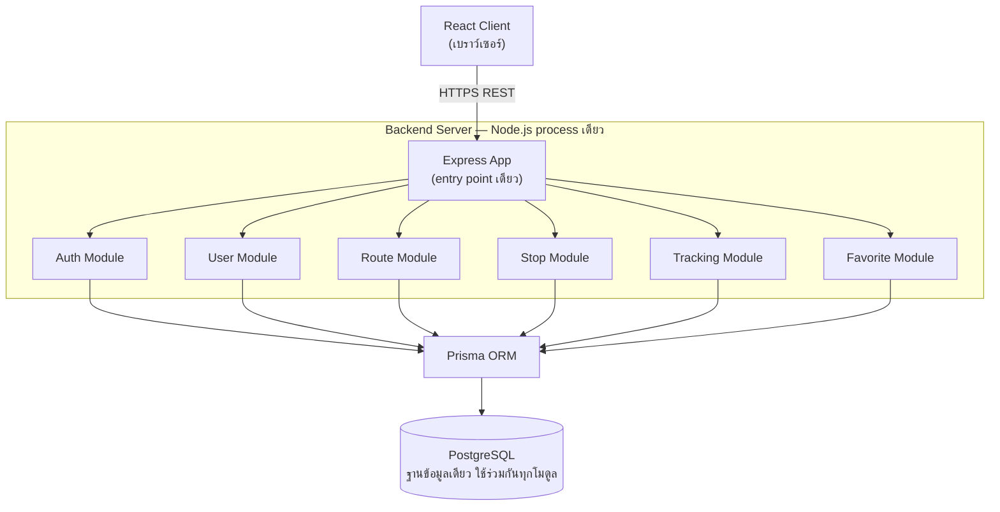
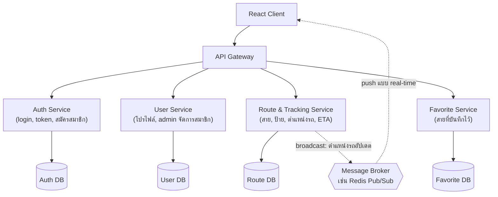

# สายเลข — Architecture & Technology Stack

เอกสารนี้มี 3 ไดอะแกรมสำหรับแปะไว้ใน repo: **Technology Stack**, **สถาปัตยกรรมปัจจุบัน (Current
Architecture)**, และ **แนวคิดการแยกเป็น Microservices (Proposed Decomposition)**

> **หมายเหตุสำคัญ**: backend ของโปรเจคนี้ ณ ตอนนี้เป็น **modular monolith** — คือ Express
> process เดียว ที่แบ่งโค้ดภายในเป็นโมดูล (auth, user, route, stop, tracking, favorite) แต่ยังรัน
> อยู่ใน service เดียวกัน ใช้ฐานข้อมูลเดียวกัน **ไม่ใช่ Microservices จริง** (ต่างจากตัวอย่าง Netflix
> ที่แต่ละ service แยกรันจริง มีฐานข้อมูลของตัวเอง) เอกสารนี้จึงแบ่งเป็น 2 ไดอะแกรม: ของจริงที่มีอยู่
> ตอนนี้ กับแนวคิดว่าถ้าจะแยกเป็น microservices ในอนาคตจะแยกแบบไหน — เพื่อให้ตรงกับความเป็นจริง
> และแสดงว่าเข้าใจแนวคิด microservices โดยไม่ได้อ้างเกินจริงว่าของที่ทำอยู่คือ microservices

---

## 1. Technology Stack Diagram

---

## 2. สถาปัตยกรรมปัจจุบัน (Current Architecture — Modular Monolith)

**ทำไมยังไม่ใช่ microservices**: ทุกโมดูล deploy พร้อมกันเป็น container เดียว (`sailoh_api`),
ถ้า module ไหน crash ทั้ง process ล้มหมด, และทุกโมดูลอ่าน/เขียนตาราง Postgres ตารางเดียวกันโดยตรง
ไม่มีการสื่อสารผ่าน network ระหว่างโมดูล (เรียกฟังก์ชันกันตรง ๆ ใน process เดียว)

---

## 3. แนวคิดการแยกเป็น Microservices (Proposed Decomposition — ยังไม่ได้ทำจริง)

ถ้าต้องขยายระบบในอนาคต (เช่น รองรับผู้ใช้จำนวนมาก หรือให้ทีมแยกกันดูแลแต่ละส่วน) แนวทางที่
เหมาะกับโดเมนนี้คือแยกตาม **bounded context**:

**เหตุผลที่แยกแบบนี้**:
- **Auth Service** แยกออกมาเพราะเรียกใช้บ่อยที่สุดและต้องการความปลอดภัยสูงสุด — scale แยกจากส่วนอื่นได้
- **Route & Tracking Service** มีโหลดสูงสุด (ตำแหน่งรถอัปเดตถี่/ถูก poll บ่อย) ควร scale ออกเป็นหลาย
  instance ได้โดยไม่กระทบส่วนอื่น
- **Favorite Service** เบาที่สุด แยกเพื่อไม่ให้ไปแย่ง resource กับส่วนที่โหลดสูง
- เพิ่ม **Message Broker** สำหรับกรณีอยากได้ตำแหน่งรถแบบ push จริง (ตอนนี้ frontend ยัง poll
  `GET /routes/:id/location` เป็นช่วง ๆ ไม่ใช่ real-time push)

**Trade-off ที่ควรพูดถึงถ้าถูกถาม**: การแยกแบบนี้เพิ่ม complexity มาก (ต้องมี service discovery,
network latency ระหว่าง service, ต้องจัดการ distributed transaction ถ้าจะบันทึก favorite ที่ต้อง
เช็คทั้ง User Service และ Route Service) — สำหรับขนาดโปรเจคนี้ **modular monolith แบบปัจจุบัน
เหมาะสมกว่าจริง ๆ** เพราะจำนวนผู้ใช้และ traffic ยังน้อย การแยก microservices ตอนนี้จะเป็นการ
over-engineer โดยไม่ได้ประโยชน์คุ้มกับต้นทุนที่เพิ่มขึ้น
