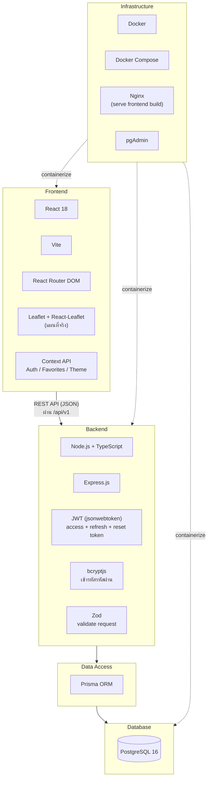
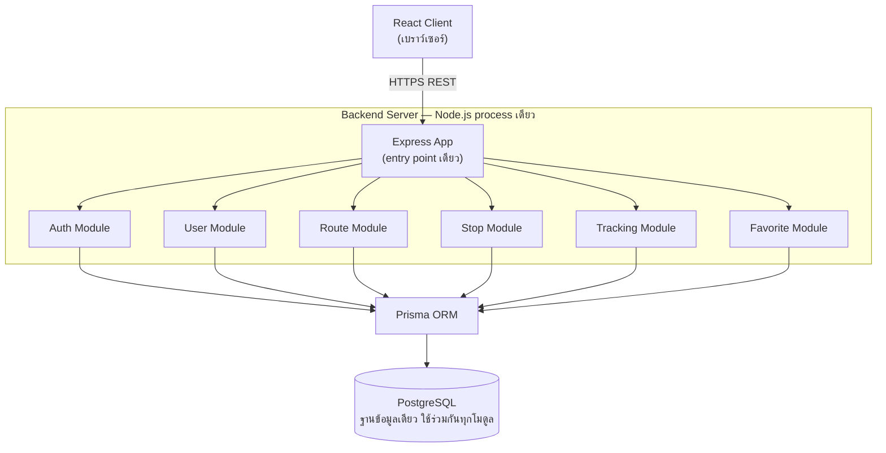
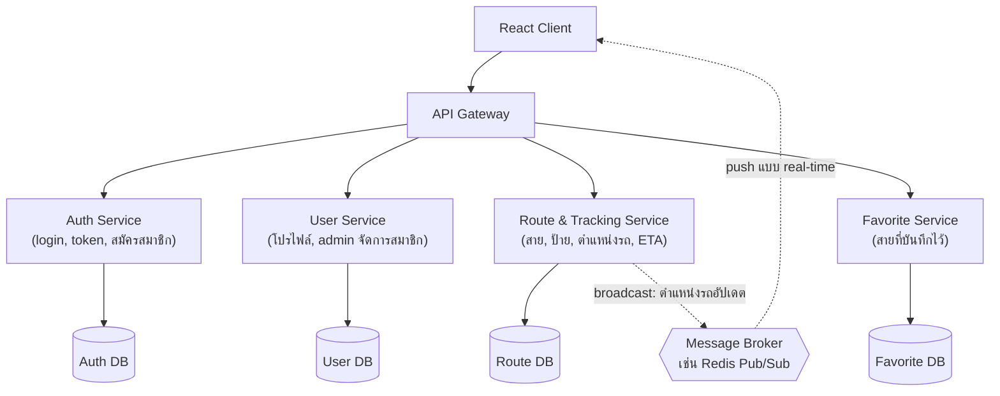

# 67160223 นายบูรพา โพธิ์ศรี
# 67160228 นายพิสิษฐ์สรรค์ ปรีชา
# สายเลข — เช็คสายรถเมล์ Real-time (Fullstack, รวมโฟลเดอร์เดียว)

รวม backend (`backend/`) กับ frontend (`frontend/`) ไว้ในโปรเจกต์เดียว เปิด/รันจากที่เดียว
ไม่ต้องสับเปลี่ยนไปมาระหว่างสองโฟลเดอร์แยกกันอีก

```
sailoh-fullstack/
├── docker-compose.yml   ← ไฟล์เดียว รันทั้ง db + api + frontend + pgadmin
├── .env.example
├── backend/             ← เดิมคือ bus-tracking-api (TypeScript + Express + Prisma + PostgreSQL)
└── frontend/            ← เดิมคือ final-bus-tracker (React + Vite)
```

## ความคืบหน้าโครงการ (Self-Assessment)

**ภาพรวม: ~75% เสร็จสมบูรณ์** _(ตัวเลขประมาณ — ปรับตามความเห็นจริงของทีมก่อนรายงาน)_

| หมวด | ความคืบหน้า | หมายเหตุ |
|---|---|---|
| Authentication (register/login/refresh/logout/เปลี่ยน-ลืมรหัสผ่าน) | 100% | ครบทุก endpoint |
| User Management (CRUD, pagination, check-username) | 100% | ครบทุก endpoint |
| Core Business Logic (สาย/ป้าย/ตำแหน่งรถ/ETA/บันทึกสาย) | ~90% | ขาดแค่เชื่อม GPS จริง |
| Admin Dashboard | 100% | จัดการผู้ใช้ครบ |
| Frontend เชื่อมต่อ API จริง | ~20% | มีแผนที่จริง 
| Docker (รันครบทั้งระบบด้วยคำสั่งเดียว) | 100% | รันได้แค่ local เท่านั้น |
| Security เสริม (rate limiting, automated tests) | ~20% | ยังไม่ได้ทำ |
| Real-time push (WebSocket) | 0% | ตอนนี้ frontend poll ข้อมูลเป็นช่วง ๆ แทน |

**สิ่งที่ยังไม่เสร็จ (ทำต่อได้ถ้ามีเวลา):**
- ตำแหน่งรถยังเป็นข้อมูลที่ admin กรอกเองผ่าน API ยังไม่เชื่อมกับอุปกรณ์ GPS จริงบนรถเมล์
- ยังไม่มี automated tests (unit/integration)
- ยังไม่ได้ deploy ขึ้น production จริง — รันได้แค่บนเครื่อง local ผ่าน Docker Compose
- ยังไม่มี rate limiting ป้องกัน brute-force ที่ `/auth/login` และ `/auth/register`
- ยังไม่มีระบบส่งอีเมลจริงสำหรับ `forgot-password` (ตอนนี้คืน `resetToken` ตรงใน response เพื่อทดสอบ)

## วิธีรันแบบเร็วที่สุด (1 คำสั่ง ได้ครบทุกอย่าง)

```bash
cp .env.example .env
cp backend/.env.example backend/.env
# แก้ JWT_ACCESS_SECRET / JWT_REFRESH_SECRET / JWT_RESET_SECRET ใน backend/.env
# ให้เป็นค่าสุ่มของจริงก่อนใช้งานจริง (ตัวอย่างที่ให้มาใช้ได้แค่ตอนทดสอบ)

docker compose up --build
```

รอจน container ทั้ง 4 ตัว (`sailoh_db`, `sailoh_api`, `sailoh_frontend`, `sailoh_pgadmin`) ขึ้นเป็น
`Up`/`Healthy` แล้วเข้าใช้งานได้ที่:

| อะไร | ที่ไหน |
|---|---|
| **หน้าเว็บ (frontend)** | http://localhost:8081 |
| API | http://localhost:4000/api/v1 |
| pgAdmin (ดูฐานข้อมูล) | http://localhost:8080 |

จากนั้น seed ข้อมูลตัวอย่าง (สร้างบัญชี admin + สายรถเมล์ตัวอย่าง — ทำครั้งเดียวพอ):

```bash
docker compose exec api npm run prisma:seed
```

ได้บัญชี `username: admin` / `password: Admin@1234` (role ADMIN) — เปลี่ยนรหัสผ่านทันทีก่อนใช้งานจริง

> ปิดโปรแกรมด้วย `docker compose down` เปิดใหม่รอบหน้าแค่ `docker compose up` (ไม่ต้อง `--build` ซ้ำ
> ถ้าไม่ได้แก้โค้ด)

## ทางเลือกที่ 2: dev แบบ hot-reload (สำหรับตอนกำลังแก้โค้ด frontend บ่อยๆ)

วิธีข้างบน build frontend เป็นไฟล์ static ทุกครั้งที่แก้โค้ดต้อง `docker compose up --build frontend`
ใหม่ ถ้ากำลังแก้ frontend บ่อยๆ ใช้วิธีนี้จะสะดวกกว่า (มี hot-reload):

```bash
# เทอร์มินัลที่ 1 — รันแค่ db + api ผ่าน docker
docker compose up db api

# เทอร์มินัลที่ 2 — รัน frontend แบบ dev server ธรรมดา
cd frontend
cp .env.example .env
npm install
npm run dev
```

เปิด http://localhost:5173 แทน (Vite dev server มี hot-reload ให้)

## Flow การใช้งาน

1. เข้าเว็บ → เห็นหน้าหลักได้เลยทันที **ไม่ต้อง login** — ค้นหาสาย, ดูตำแหน่ง/ETA ได้แบบสาธารณะ
2. มุมขวาบน: ปุ่ม **⚙️ ตั้งค่า** (ใช้ได้ทุกคน — สลับโหมดสว่าง/มืด) และตามด้วยปุ่ม **"เข้าระบบ"** (ยังไม่ login)
   หรือ **avatar** (login แล้ว — รูปโปรไฟล์หรือตัวอักษรแรก)
3. ในหน้ารายละเอียดสาย กดแท็บ **"แผนที่"** เพื่อดูแผนที่จริงแบบ pan/zoom ได้ (OpenStreetMap/CartoDB) —
   เห็นตำแหน่งป้ายทุกป้ายและตำแหน่งรถล่าสุดถ้ามีข้อมูล GPS แล้ว สลับกับแท็บ "รายการป้าย" ได้ตลอด
4. ฟีเจอร์ที่ต้อง login: บันทึกสาย, หน้า "สายที่บันทึก" — กดตอนยังไม่ login จะเด้งไปหน้า login ให้เอง
5. สมัครสมาชิก/ลืมรหัสผ่านทำได้ในตัว ไม่ต้องพึ่งอีเมลจริง (ดูรายละเอียดด้านล่าง)
6. หน้าโปรไฟล์: ดู/แก้ไขข้อมูลตัวเอง, **เปลี่ยน/ลบรูปโปรไฟล์**, เปลี่ยนรหัสผ่าน, ออกจากระบบ
7. บัญชี role `ADMIN` จะเห็นลิงก์ไปหน้า Admin Dashboard (`/admin/users`) จัดการสมาชิกทั้งระบบได้

## Endpoints ทั้งหมด (prefix: `/api/v1`)

### Authentication
| Method | Path | คำอธิบาย |
|---|---|---|
| POST | `/auth/register` | สมัครสมาชิก |
| POST | `/auth/login` | เข้าสู่ระบบ → คืน `accessToken` + `refreshToken` |
| POST | `/auth/refresh` | ขอ access token ใหม่ (rotate ให้ทั้งคู่) |
| POST | `/auth/logout` | ออกจากระบบ (เพิกถอน `refreshToken`) |
| POST | `/auth/change-password` | เปลี่ยนรหัสผ่านตอน login อยู่ |
| POST | `/auth/forgot-password` | ลืมรหัสผ่าน — ยืนยันด้วย username+email คืน `resetToken` |
| POST | `/auth/reset-password` | ตั้งรหัสผ่านใหม่ด้วย `resetToken` |

### User Management
| Method | Path | คำอธิบาย |
|---|---|---|
| GET | `/users/me` | ดึงข้อมูลตัวเอง |
| GET | `/users` | รายชื่อผู้ใช้ทั้งหมด `?page=&limit=&search=` (ADMIN) |
| GET | `/users/:id` | ดึงผู้ใช้ตาม ID |
| PUT | `/users/:id` | แก้ไข `email`, `displayName`, `avatarUrl`, `role` (role: ADMIN เท่านั้น) |
| DELETE | `/users/:id` | ลบผู้ใช้ |
| GET | `/users/check-username/:username` | เช็ค username ว่าง (สาธารณะ) |

### Bus Routes (Core Business Logic)
| Method | Path | คำอธิบาย |
|---|---|---|
| GET | `/routes` | รายการสาย `?page=&limit=&search=` (สาธารณะ) |
| GET | `/routes/search?q=` | auto-suggest (สาธารณะ) |
| GET | `/routes/:id` | รายละเอียดสาย (สาธารณะ) |
| POST/PUT/DELETE | `/routes(/:id)` | จัดการสาย (ADMIN) |
| POST/PUT/DELETE | `/routes/:id/stops`, `/stops/:stopId` | จัดการป้าย (ADMIN) |
| GET | `/routes/:id/location` | ตำแหน่งรถล่าสุด (สาธารณะ) |
| POST | `/routes/:id/location` | อัปเดตตำแหน่งรถ (ADMIN) |
| GET | `/routes/:id/eta?stopId=` | ประมาณเวลาถึง (สาธารณะ) |
| GET/POST/DELETE | `/favorites(/:routeId)` | สายที่บันทึกไว้ (ต้อง login) |

รวม 28 endpoints — รายละเอียดฉบับเต็มพร้อมตัวอย่าง curl อยู่ในคอมเมนต์ของแต่ละไฟล์ใน `backend/src/modules/`

## โครงสร้างย่อยของแต่ละส่วน

**`backend/`** — Express + TypeScript + Prisma, แยกเป็น module (`auth`, `user`, `route`, `stop`,
`tracking`, `favorite`) แต่ละอันมี `*.schema.ts` (zod) / `*.service.ts` / `*.controller.ts` / `*.routes.ts`
ของตัวเอง Response format มาตรฐานทั้งระบบ: `{ success, data, message }` หรือ `{ success, message, error }`

**`frontend/`** — React + Vite, มี `AuthContext` (access/refresh token + auto-refresh),
`FavoritesContext`, `RouteGuards` (`ProtectedRoute`/`GuestOnly`/`AdminRoute`), หน้า Login/Register/
ForgotPassword/Profile/AdminUsers/AdminUserDetail ครบ

**แผนที่จริงในหน้ารายละเอียดสาย** — แท็บ "แผนที่" ในหน้า `/route/:id` ใช้แผนที่จริง pan/zoom ได้
(Leaflet + OpenStreetMap/CartoDB ฟรี ไม่ต้องขอ API key เหมือน Google Maps) แสดงเส้นทางเดินรถ
เชื่อมป้ายตามลำดับ, ป้ายถัดไปไฮไลต์สีเหลืองอำพัน, และไอคอนรถเมล์ 🚌 ที่ตำแหน่งล่าสุดจาก GPS จริง
สีเปลี่ยนตามสถานะ — ชุด tile ของแผนที่เองก็สลับสว่าง/มืดตามธีมแอปด้วย — component อยู่ที่
`frontend/src/components/RouteMap.jsx`

**โหมดสว่าง/มืด** — `ThemeContext` (`frontend/src/context/ThemeContext.jsx`) จำค่าไว้ใน
`localStorage`, ใช้ค่า `prefers-color-scheme` ของเบราว์เซอร์เป็นค่าเริ่มต้นถ้ายังไม่เคยตั้งเอง
สลับได้จากปุ่ม ⚙️ ที่มุมขวาบนทุกหน้า (`/settings`) ไม่ต้อง login เพราะเป็นการตั้งค่าเครื่อง
ไม่ใช่ข้อมูลบัญชี ทั้งแอปใช้ CSS custom properties (`--bg`, `--surface`, `--text` ฯลฯ ใน
`frontend/src/index.css`) จึงสลับสีทั้งแอปพร้อมกันได้จากจุดเดียว ไม่ต้องแก้ทีละ component

## Architecture & Technology Stack

> **หมายเหตุสำคัญ**: backend ของโปรเจคนี้ ณ ตอนนี้เป็น **modular monolith** — คือ Express
> process เดียว ที่แบ่งโค้ดภายในเป็นโมดูล (auth, user, route, stop, tracking, favorite) แต่ยังรัน
> อยู่ใน service เดียวกัน ใช้ฐานข้อมูลเดียวกัน **ไม่ใช่ Microservices จริง** (ต่างจากตัวอย่าง Netflix
> ที่แต่ละ service แยกรันจริง มีฐานข้อมูลของตัวเอง) จึงแบ่งเป็น 2 ไดอะแกรม: ของจริงที่มีอยู่ตอนนี้
> กับแนวคิดว่าถ้าจะแยกเป็น microservices ในอนาคตจะแยกแบบไหน — เพื่อให้ตรงกับความเป็นจริง และ
> แสดงว่าเข้าใจแนวคิด microservices โดยไม่ได้อ้างเกินจริงว่าของที่ทำอยู่คือ microservices

### 1. Technology Stack Diagram



### 2. สถาปัตยกรรมปัจจุบัน (Current Architecture — Modular Monolith)



**ทำไมยังไม่ใช่ microservices**: ทุกโมดูล deploy พร้อมกันเป็น container เดียว (`sailoh_api`),
ถ้า module ไหน crash ทั้ง process ล้มหมด, และทุกโมดูลอ่าน/เขียนตาราง Postgres ตารางเดียวกันโดยตรง
ไม่มีการสื่อสารผ่าน network ระหว่างโมดูล (เรียกฟังก์ชันกันตรง ๆ ใน process เดียว)

### 3. แนวคิดการแยกเป็น Microservices (Proposed Decomposition — ยังไม่ได้ทำจริง)

ถ้าต้องขยายระบบในอนาคต (เช่น รองรับผู้ใช้จำนวนมาก หรือให้ทีมแยกกันดูแลแต่ละส่วน) แนวทางที่
เหมาะกับโดเมนนี้คือแยกตาม **bounded context**:



**เหตุผลที่แยกแบบนี้**:
- **Auth Service** แยกออกมาเพราะเรียกใช้บ่อยที่สุดและต้องการความปลอดภัยสูงสุด — scale แยกจากส่วนอื่นได้
- **Route & Tracking Service** มีโหลดสูงสุด (ตำแหน่งรถอัปเดตถี่/ถูก poll บ่อย) ควร scale ออกเป็นหลาย
  instance ได้โดยไม่กระทบส่วนอื่น
- **Favorite Service** เบาที่สุด แยกเพื่อไม่ให้ไปแย่ง resource กับส่วนที่โหลดสูง
- เพิ่ม **Message Broker** สำหรับกรณีอยากได้ตำแหน่งรถแบบ push จริง (ตอนนี้ frontend ยัง poll
  `GET /routes/:id/location` เป็นช่วง ๆ ไม่ใช่ real-time push)

**Trade-off ที่ควรพูดถึงถ้าถูกถาม**: การแยกแบบนี้เพิ่ม complexity มาก (ต้องมี service discovery,
network latency ระหว่าง service, ต้องจัดการ distributed transaction ถ้าจะบันทึก favorite ที่ต้อง
เช็คทั้ง User Service และ Route Service) — สำหรับขนาดโปรเจคนี้ **modular monolith แบบปัจจุบัน
เหมาะสมกว่าจริง ๆ** เพราะจำนวนผู้ใช้และ traffic ยังน้อย การแยก microservices ตอนนี้จะเป็นการ
over-engineer โดยไม่ได้ประโยชน์คุ้มกับต้นทุนที่เพิ่มขึ้น

## หมายเหตุด้านความปลอดภัยก่อนขึ้น production

- เปลี่ยน `JWT_ACCESS_SECRET` / `JWT_REFRESH_SECRET` / `JWT_RESET_SECRET` เป็นค่าสุ่มยาว ๆ ของจริง
- จำกัด `CORS_ORIGIN` ใน `backend/.env` ให้เป็นโดเมน frontend จริงเท่านั้น
- เพิ่ม rate limiting ที่ `/auth/login`, `/auth/register` กัน brute-force
- เปลี่ยนรหัสผ่าน pgAdmin/Postgres จากค่าตัวอย่างก่อน deploy จริงเสมอ
- `forgot-password` คืน `resetToken` ตรงใน response เพราะโปรเจกต์นี้ไม่มีระบบส่งอีเมล — ของจริงต้อง
  ส่งทางอีเมลเท่านั้น
- `avatarUrl` เก็บเป็น data URL (base64) ตรงในฐานข้อมูล เพื่อความง่าย — ของจริงควรใช้ object storage
  (S3, Cloudinary ฯลฯ) แล้วเก็บแค่ URL แทน
